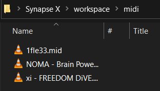

# MidiPlayer

Virtual piano midi file autoplayer for Roblox

## Install

To install MidiPlayer for your script executor, save the `package.lua` file located in this repository to your `scripts/` folder.

## Usage

To play midi files, simply add them to the `midi/` folder in your exploit's workspace directory.

Your midi files will be accessible in the UI:

https://user-images.githubusercontent.com/74037129/121129781-4ccd6e80-c7e2-11eb-8a59-561aebb2cf8b.mp4

The circular button nxet to the title toggles midi visualization, as larger files may cause framerate issues.

## Notes

* UI is built into the project at `src/Assets/ScreenGui.rbxm`, so no assets are loaded
* HTTP requests only check for updates and download the project

## Drawbacks

* Executes from start to finish, including all code execution and `require` calls, in 80ms in Synapse-X
  * There is much room for improvement, though loading times vary between script executors

Want to make a contribution to Rostruct? [See the repository here](https://github.com/richie0866/Rostruct)
